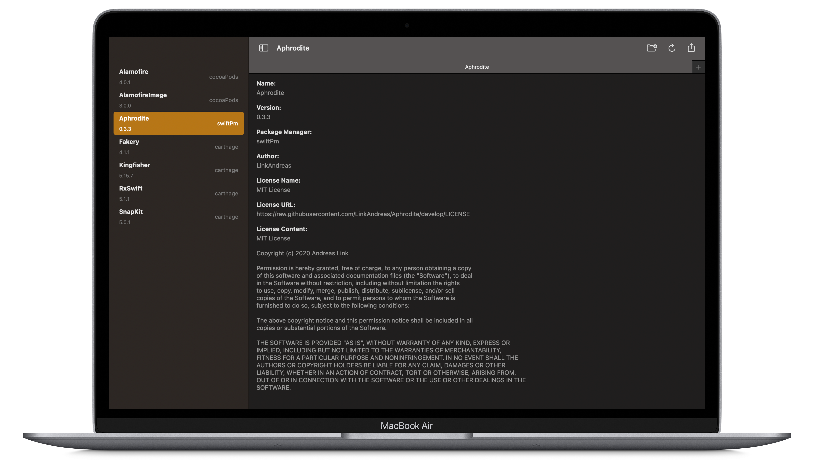
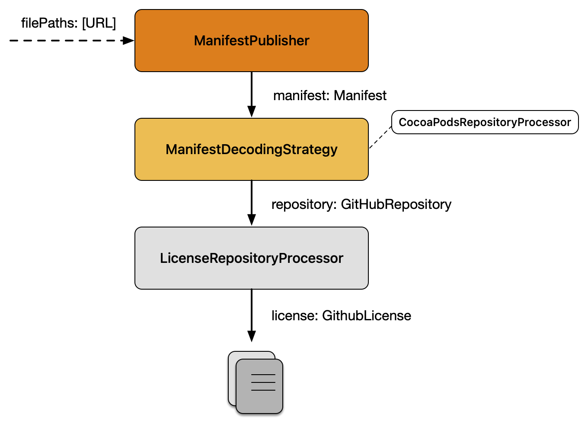
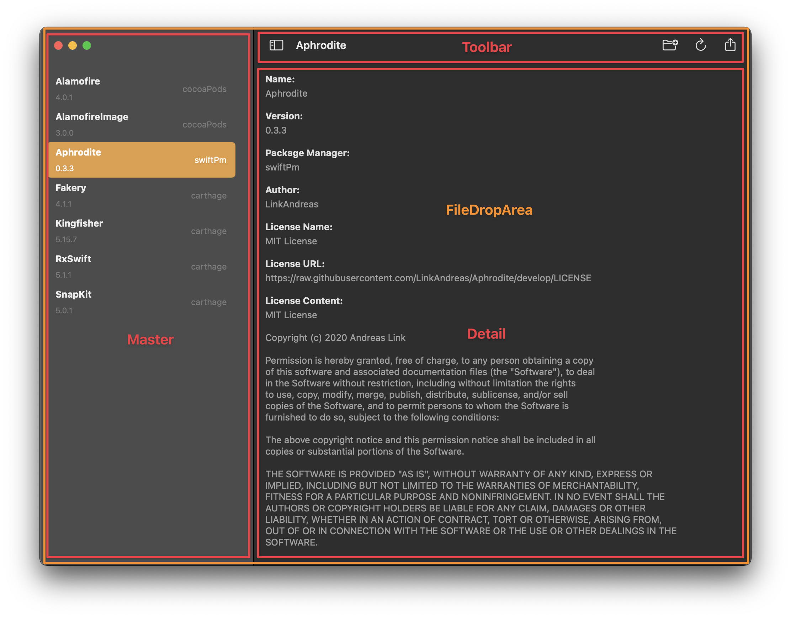
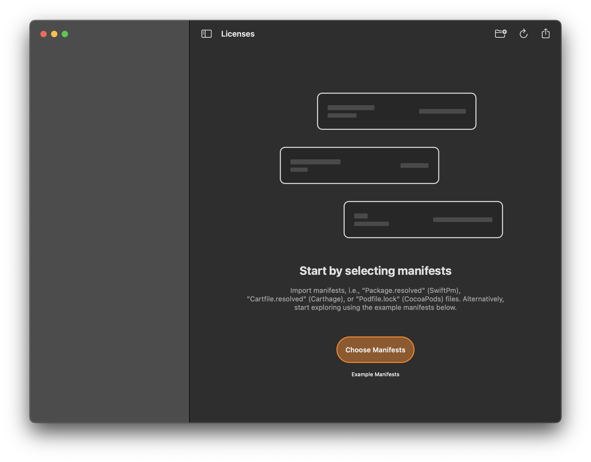
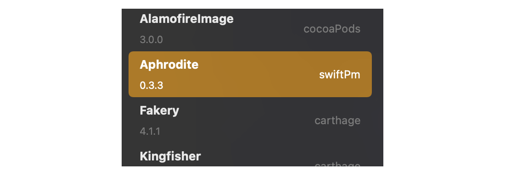
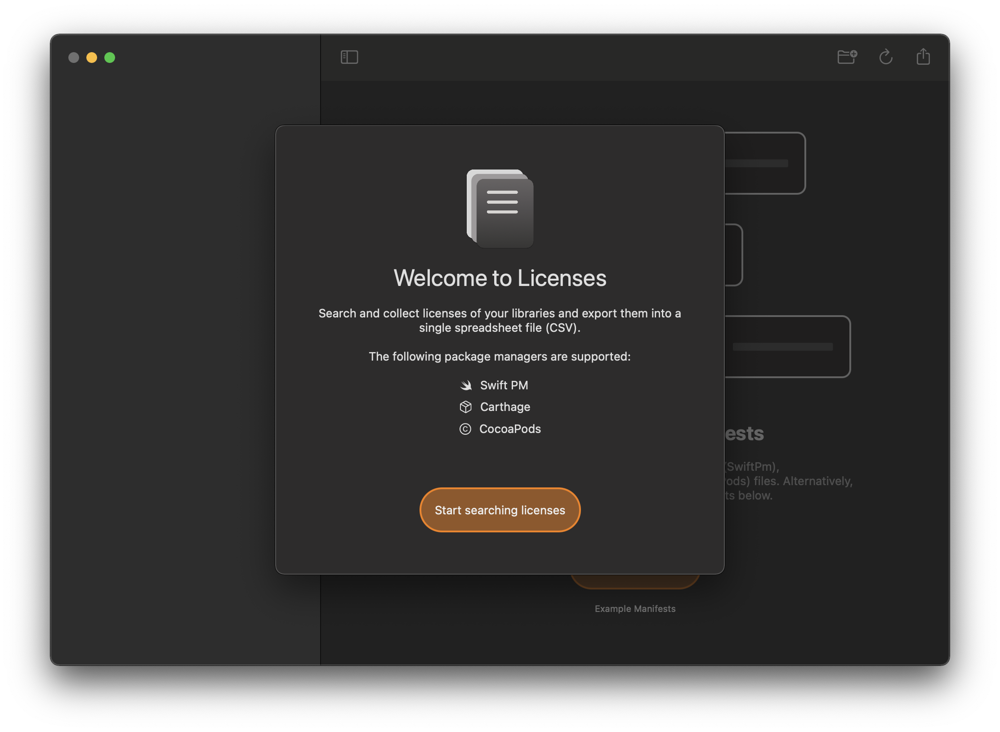

# Building a native macOS app using SwiftUI and Combine

Have you ever been asked to put together the list of licenses of all frameworks that are used within your iOS, iPad OS, or macOS app? Manually completing this task quickly becomes tedious but may be required due to legal- or customer requests.

To mitigate this issue, I developed **Licenses**, a native macOS app that automates this procedure by collecting and exporting your licenses into a single spreadsheet (CSV) file.

In this article, I want to share my experience as well as the challenges that I faced when developing the app using *SwiftUI 2.0* and *Combine*. This way, I hope to provide additional documentation on how declarative macOS apps can be built and to encourage others to also bring their ideas to the Mac.

You can get the latest version of Licenses in the Mac AppStore ([Link](https://apps.apple.com/us/app/licenses/id1545822966)) or check out the project on GitHub ([Link](https://github.com/LinkAndreas/Licenses)).

# Architecture
*Licenses*, uses a redux-inspired architecture, as illustrated in figure 1, consisting of Data-, Bloc-, ViewStore- and UI-related components. This way, state changes only occur within the bloc's reducer function, transforming incoming actions as well as the current state to an updated state that is ultimately consumed by the UI.


Also, side effects are performed by returning publishers from the reducer resulting in additional actions that are sent to the bloc. Hence, asynchronous work is treated similarly to synchronous work in the way that it only affects the state from within the reducer. Thus, the correctness of the reducer and as such the correctness of all state changes becomes testable through unit tests.

Note that blocs are not directly connected to the UI, but rather via view stores that act as the main communication gateway of the view. As a result, domain-specific knowledge is not exposed, but rather gets translated into view-specific models that only include the formatted data that is ready to be shown in the UI. As an example, instead of passing repositories, i.e., `[GitHubRepository]`, to the view directly, we can rather pass a list of items, i.e., `[ListItem]`, where each item only consists of UI-related data (e.g., `title` or `subtitle`) and omits any internal data that is repository-specific. Similarly, view actions are translated into domain-specific actions that are forwarded by the view store to the bloc. Excluding business- and domain-specific knowledge out of the view keeps them lean and facilitates simplified previews using mock data in Xcode.

Having established an architectural overview of the app, let's focus on the business logic in terms of the processing pipeline that derives licenses from manifests that are read from disk.

# Business Logic: The Manifest Processing Pipeline
Users can select manifests in *Licenses* by either dragging them on top of the application's window or choosing them manually from disk. In this regard, it does not matter whether single or multiple files are selected or whether they are kept in an enclosing folder. Either way, *Licenses* searches for manifests at the specified location and forwards their `filePaths: [URL]` to the processing pipeline. As illustrated in figure 2, decoding and extracting licenses involves three consecutive steps:



## Step 1: Manifest Publisher:
First, *Licenses* searches for files named "Package.resolved" (SwiftPm), "Cartfile.resolved" (Carthage) or "Podfile.lock" (CocoaPods) and instantiates a `Manifest` for each occurence respectively.

```swift
import Combine
import Foundation

struct ManifestPublisher: Publisher {
    typealias Output = Manifest
    typealias Failure = Never

    private let subject: PassthroughSubject<Manifest, Never> = .init()
    private let dispatchGroup: DispatchGroup = .init()
    private let dispatchQueue: DispatchQueue = .global(qos: .userInitiated)
    private let filePaths: [URL]

    init(filePaths: [URL] = []) {
        self.filePaths = filePaths
    }

    func receive<S>(subscriber: S) where S: Subscriber, Self.Failure == S.Failure, Self.Output == S.Input {
        subject.subscribe(subscriber)

        search(at: filePaths)
    }

    private func search(at filePaths: [URL] = []) {
        filePaths.forEach { filePath in
            dispatchGroup.enter()
            dispatchQueue.async(group: dispatchGroup) {
                defer { self.dispatchGroup.leave() }

                var isDirectory: ObjCBool = false
                let fileManager: FileManager = .init()

                guard fileManager.fileExists(atPath: filePath.path, isDirectory: &isDirectory) else { return }

                if isDirectory.boolValue {
                    let enumerator = fileManager.enumerator(at: filePath, includingPropertiesForKeys: nil)
                    while let nextFilePath: URL = enumerator?.nextObject() as? URL {
                        guard let manifest = Manifest(fromFilePath: nextFilePath) else { continue }

                        self.subject.send(manifest)
                    }
                } else {
                    guard let manifest = Manifest(fromFilePath: filePath) else { return }

                    self.subject.send(manifest)
                }
            }
        }

        dispatchGroup.notify(queue: .main) {
            self.subject.send(completion: .finished)
        }
    }
}
```

The initializer matches the last component of the given file path against a predefined set of identifiers. As soon as a match is made, the package manager associated with the file name is assigned to the manifest. Note that the latter is required to determine the decoding strategy that is used to derive packages from the manifest.

```swift
struct Manifest: Equatable {
    var packageManager: PackageManager
    var content: String
    var filePath: URL

    init(
        packageManager: PackageManager,
        content: String,
        filePath: URL
    ) {
        self.packageManager = packageManager
        self.content = content
        self.filePath = filePath
    }

    init?(fromFilePath filePath: URL) {
        switch filePath.lastPathComponent {
        case "Cartfile.resolved":
            self.packageManager = .carthage

        case "Podfile.lock":
            self.packageManager = .cocoaPods

        case "Package.resolved":
            self.packageManager = .swiftPm

        default:
            return nil
        }

        guard let content = try? String(contentsOf: filePath, encoding: .utf8) else { return nil }

        self.content = content
        self.filePath = filePath
    }
}

```

## Step 2: ManifestDecodingStrategy
Second, *Licenses* tries to retrieve the minimum set of data, like the name, author, and version of the package by applying the decoding strategy that is associated with its type. Since the decoding may fail due to syntax errors or missing information, *Licenses* tries to handle these cases gracefully by continuing decoding the remaining set of manifests.

Note that the algorithm makes use of the strategy pattern to be easily extensible in the future if new package managers come along. This way, we can define additional strategies by conforming to the `ManifestDecodingStrategy` protocol:

```swift
protocol ManifestDecodingStrategy {
    func decode(content: String) -> AnyPublisher<GithubRepository, Never>
}

```
As an example, please consider the implementation of the `SwiftPmManifestDecodingStrategy` as stated below. If the strategy could decode the given content as `ResolvedPackagesEntity` it publishes an instance of `GithubRepository` for each package respectively.

```swift
import Combine
import Foundation

struct SwiftPmManifestDecodingStrategy: ManifestDecodingStrategy {
    func decode(content: String) -> AnyPublisher<GithubRepository, Never> {
        guard
            let data = content.data(using: .utf8),
            let resolvedPackages = try? JSONDecoder().decode(ResolvedPackagesEntity.self, from: data)
        else {
            return Empty<GithubRepository, Never>().eraseToAnyPublisher()
        }

        return resolvedPackages
            .object
            .pins
            .publisher
            .compactMap { (package: PinEntity) -> GithubRepository? in
                guard
                    let (name, author) = GithubRepositoryUrlDecoder.decode(repositoryUrlString: package.repositoryUrl)
                else { return nil }

                let url: URL = GithubRepositoryUrlEncoder.encode(name: name, author: author)

                return .init(
                    packageManager: .swiftPm,
                    name: name,
                    version: package.state.version,
                    author: author,
                    url: url
                )
            }
            .eraseToAnyPublisher()
    }
}
```

It is important to note that packages derived from CocoaPod manifests do not include their author and hence require additional processing before licenses are fetched using the GitHub API.
The `CocoaPodsRepositoryProcessor` takes care of this requirement and uses the package manager's centralized registry named "CocoaPodsTrunk" to retrieve the missing information of the package.

## Step 3: LicenseProcessor - Retrieving Licenses from GitHub:
Finally, given the name and author of a package we have collected sufficient information to retrieve its licenses using the Github API:

```swift
struct LicenseRepositoryProcessor: RepositoryProcessor {
    func process(repository: GithubRepository) -> AnyPublisher<GithubRepository, Never> {
        guard
            repository.license == nil,
            let (name, author) = GithubRepositoryUrlDecoder.decode(repositoryURL: repository.url)
        else {
            return Just<GithubRepository>(repository)
                .eraseToAnyPublisher()
        }

        return API.requestMappedModel(
            Github.license(name: name, author: author),
            mapper: GithubLicenseModelMapper.map
        )
        .receive(on: RunLoop.main)
        .map { license in
            let modifiedRepository: GithubRepository = repository
            modifiedRepository.license = license
            return modifiedRepository
        }
        .catch { _ in Just<GithubRepository>(repository) }
        .eraseToAnyPublisher()
    }
}
```

Note that network requests in *Licenses* are made using *Aphrodite* ([Link](https://github.com/LinkAndreas/Aphrodite)), a lightweight, generic, and reactive network layer that is built on top of Combine and `NSURLSession`. This way, the `LicenseRepositoryProcessor` does not need to deal with the raw data that is returned from the Github API but rather uses a simplified model that results from the clear entity- and domain model separation offered by Aphrodite.

Consequently, all the above-mentioned steps are executed by the reducer directly or returned as side effects resulting in additional actions that are fed back into the bloc. Thus, state changes can only happen at a predefined location. As an example, please consider the handling of the `.fetchLicenses` action that corresponds to the third step of the processing pipeline: 

```swift
import Combine
import Foundation

struct AppReducer: BlocReducer {
    func reduce(
        state: inout AppState,
        action: AppAction,
        environment: AppEnvironment
    ) -> Effect<AppAction, Never> {
        switch action {
        case .fetchLicenses:
            return state.repositories
                .filter { $0.license == nil }
                .publisher
                .flatMap(maxPublishers: .max(3)) { repository in
                    Just(repository)
                        .flatMap { (repository: GithubRepository) -> AnyPublisher<GithubRepository, Never> in
                            environment.cocoaPodsProcessor.process(repository: repository)
                                .eraseToAnyPublisher()
                        }
                        .flatMap { repository in
                            environment.licenseProcessor.process(repository: repository)
                                .eraseToAnyPublisher()
                        }
                }
                .receive(on: RunLoop.main)
                .map(AppAction.didProcess(repository:))
                .prepend(AppAction.didStartFetchingLicenses)
                .append(AppAction.didStopFetchingLicenses)
                .eraseToEffect()

            ...
        }
    }
}
```

As a result, we obtain the list of repositories (`[GithubRepository]`) with their associated licenses, ready to be displayed in the UI.

# User Interface
Having referred to the *processing pipeline* as the main driver of the app, let's focus on the UI as well as the challenges that I faced when bringing *Licenses* to the Mac.

## App Lifecycle
With the introduction of the SwiftUI lifecycle at WWDC 2020, Apple removed the need for an `App-/SceneDelegate` and offered a declarative API to specify the entry point of the app. *Licenses* uses a `WindowGroup` as well as a preferences pane that is accessible via the menu as its building blocks. Additional entries like the app's privacy policy are realized using the `.commands()` modifier:

```swift
import SwiftUI

@main
struct LicensesApp: App {
    @NSApplicationDelegateAdaptor(AppDelegate.self) var delegate: AppDelegate

    var body: some Scene {
        WindowGroup {
            WindowContentContainerView()
                .frame(
                    minWidth: 1_000,
                    idealWidth: 1_200,
                    minHeight: 650,
                    idealHeight: 800,
                    alignment: .center
                )
        }.commands {
            CommandGroup(after: .help) {
                Button(L10n.PrivacyPolicy.title) {
                    guard let url = URL(string: L10n.PrivacyPolicy.url) else { return }

                    NSWorkspace.shared.open(url)
                }
            }
        }

        Settings {
            SettingsContainerView()
        }
    }
}
```

When adopting the SwiftUI lifecycle, it was difficult at first to come up with a solution to specify that the application should terminate as soon as the last window was closed. Luckily, Apple provides the `@NSApplicationDelegateAdaptor` property wrapper that supports functionality that is not covered by the declarative approach yet. This way, the intended behavior is specified in an additional `AppDelegate` class:

```swift
final class AppDelegate: NSObject, NSApplicationDelegate {
    func applicationShouldTerminateAfterLastWindowClosed(_ sender: NSApplication) -> Bool {
        return true
    }
}
```

## Bloc- and ViewStoreProvider

Within the window group, container views are used to provide the bloc as well as the view store for the window's content view. Note that the `BlocProvider` uses the `@StateObject` property wrapper internally to ensure that the lifetime of the bloc is bound to the lifespan of the window. To request a bloc via the `BlocProvider` we only need to provide the bloc's initial state as well as its reducer function that is used for handling state changes of the window. Finally, given the bloc, the `ViewStoreProvider` establishes the mapping between the view-specific state/actions as well as the domain-specific state/actions using the `WindowContentViewStateMapper` and `WindowContentViewActionMapper` respectively. Moving providers out of the view keeps our content view lean and facilitates UI development using SwiftUI previews.

```swift
struct WindowContentContainerView: View {
    var body: some View {
        BlocProvider<AppState, AppAction, AppEnvironment>(
            initialState: .initial,
            reducer: AppReducer().eraseToAnyBlocReducer(),
            environment: DefaultEnvironment()
        ) { bloc in
            ViewStoreProvider(
                statePublisher: AnyStatePublisher(
                    publisher: bloc,
                    stateMapper: WindowContentViewStateMapper.map(state:)
                ),
                actionReceiver: AnyActionReceiver(
                    receiver: bloc,
                    actionMapper: WindowContentViewActionMapper.map(action:)
                )
            ) { store in
                WindowContentView(store: store)
            }
        }
    }
}
```

## Window Content

In *Licenses* the `WindowContentView` is made of smaller views that together compose the UI. Hence, the content view uses the `ViewStore` of its parent to derive smaller stores that are dedicated for each child. As an example, the file drop area's store is derived from the parent by limiting its scope to the `fileDropAreaState` property. In addition, the `actionMapper` establishes the mapping between `FileDropAreaViewActions` and `WindowActions`.

```swift
struct WindowContentView: View {
    @ObservedObject var store: ViewStore<WindowContentViewState, WindowContentViewAction>

    var body: some View {
        FileDropAreaView(
            store: store.derived(
                stateMapper: \.fileDropAreaState,
                actionMapper: WindowContentViewAction.fileDropArea(action:)
            )
        ) {
            NavigationView {
                MasterView(
                    store: store.derived(
                        stateMapper: \.masterState,
                        actionMapper: WindowContentViewAction.master(action:)
                    )
                )
                DetailView(
                    store: store.derived(
                        stateMapper: \.detailState,
                        actionMapper: WindowContentViewAction.detail(action:)
                    )
                )
            }
            .toolbar {
                ToolbarItems(
                    store: store.derived(
                        stateMapper: \.toolbarState,
                        actionMapper: WindowContentViewAction.toolbar(action:)
                    )
                )
            }
        }
        .sheet(
            isPresented: store.binding(
                get: \.isOnboardingPresented,
                send: { isOnboardingPresented in .updateIsOnboardingCompleted(!isOnboardingPresented) }
            ),
            content: {
                OnboardingView(
                    store: store.derived(
                        stateMapper: \.onboardingState,
                        actionMapper: WindowContentViewAction.onboarding(action:)
                    )
                )
            }
        )
        .onAppear { store.send(.didAppear) }
        .onDisappear { store.send(.didDisappear) }
    }
}
```

Figure 3 visualizes the structure of the window:



### File Drop Area

Note that SwiftUI features the `onDrop(of:isTargeted:content)` modifier which is well-suited for our needs. In addition to the supported file type, i.e., "public.file-url", we also specify a binding to `isTargeted` property of the store. Note that the binding is derived from the store such that it sends a `.didUpdateIsTargeted(Bool)` action as soon as a change is made. Similarly, the view store is notified by the view when files of the specified type are detected (`.didSelectProviders([NSItemProvider]`).  

```swift
import SwiftUI

struct FileDropAreaView<Content: View>: View {
    @ObservedObject var store: ViewStore<FileDropAreaViewState, FileDropAreaViewAction>

    private let content: () -> Content

    init(
        store: ViewStore<FileDropAreaViewState, FileDropAreaViewAction>,
        @ViewBuilder content: @escaping () -> Content
    ) {
        self._store = .init(initialValue: store)
        self.content = content
    }

    var body: some View {
        GeometryReader { geometry in
            Group {
                VStack {
                    self.content()
                        .onDrop(
                            of: store.supportedFileTypes,
                            isTargeted: store.binding(
                                get: \.isTargeted,
                                send: { isTargeted in .didUpdateIsTargeted(isTargeted) }
                            )
                        ) { providers -> Bool in
                            store.send(.didSelectProviders(providers))
                            return true
                        }
                        .border(store.borderColor)
                }
                .frame(width: geometry.size.width, height: geometry.size.height)
            }
        }
    }
}
```

The file drop area's content consists of the `NavigationView` that establishes the master-detail relationship between the repository list (master) and the repository's detail view. Note that the latter is only shown when repositories exist. Otherwise, a placeholder is shown asking the user to either import manifests manually from disk or to use one of the example-manifests that are bundled with the app.



### Repository List (Master)

As soon as manifests are selected, detected repositories are shown in NavigationView's sidebar. Unfortunately, I could not find a solution to specify different styles for the background of a list item, similar to what is offered by the `.emphasized` style of `NSTableViewCell`. The behavior is desired since we can improve the readability of the selected item by adapting the font color of the title and subtitle label in case that the item is selected:



Although you can pass a binding to access the selected item, it does not account for the emphasized state of the cell and is only changed when the selection got made. To provide feedback even before the cursor is lifted, I decided to bridge to a standard `NSTableView` using the `NSViewControllerRepresentable` protocol:

```swift
import SwiftUI

struct RepositoryListView: NSViewControllerRepresentable {
    @ObservedObject var store: ViewStore<RepositoryListViewState, RepositoryListViewAction>

    func updateNSViewController(_ nsViewController: RepositoryListViewController, context: Context) {
        return
    }

    func makeNSViewController(context: Context) -> RepositoryListViewController {
        return .init(store: store)
    }
}

struct RepositoryListView_Previews: PreviewProvider {
    static var previews: some View {
        RepositoryListView(store: .constant(state: PreviewData.RepositoryList.state))
    }
}
```

Note that in the future we can drop the `NSTableView` and rather use SwiftUI's default `List` component as soon as the emphasized state is supported. If you are interested in the detailed implementation of the `NSTableView` please have a look at the source code on Github ([Link](https://github.com/LinkAndreas/Licenses)).

### Repository Metadata (Detail)

The detail view of the `NavigationView` provides additional metadata about the selected repository, like the license's type and content that was fetched using the Github API:

```swift
struct DetailView: View {
    @ObservedObject var store: ViewStore<DetailViewState, DetailViewAction>

    var body: some View {
        Group {
            ViewStoreWithNonOptionalStateProvider(
                from: store.derived(stateMapper: \.listState).withoutActions,
                success: DetailListView.init(store:),
                failure: ViewStoreWithNonOptionalStateProvider(
                    from: store.derived(
                        stateMapper: \.placeholderState,
                        actionMapper: DetailViewAction.placeholder(action:)
                    ),
                    success: DetailPlaceholderView.init(store:)
                )
            )
        }
        .navigationTitle(store.navigationTitle)
        .frame(minWidth: 0, maxWidth: .infinity, minHeight: 0, maxHeight: .infinity, alignment: .center)
    }
}
```

Note that the detail view uses the `ViewStoreWithNonOptionalStateProvider` instead of the default `ViewStoreProvider` since the parent's `listState` and `placeholderState` may be `nil`. The `DetailViewStateMapper` decides whether the placeholder or a repository's metadata is shown. Hence, the `ViewStoreWithNonOptionalStateProvider` only renders the `DetailListView` in case that the parent's `listState` is not `nil`. Otherwise the provider fallbacks to the failure case and renders the provided component in case it exists. Similarly, the `DetailPlaceholderView` is only shown if the parent's `placeholderState` is not `nil`. This way, the `ViewStoreWithNonOptionalStateProvider` provides a non-optional state to the child if the parent's state is not `nil`. Otherwise, it renders the `failure` view.

### Toolbar

The toolbar provides quick access to the main features of the app. As an example, users can import manifests using the toolbar's primary action. Besides, users can toggle the sidebar's visibility using the navigation button of the bar. Unfortunately, `NavigationView` does not offer a modifier to specify the sidebar's visibility. Instead, we can search for the `SplitViewController` that is the first responder in the key window and toggle its sidebar:

```swift
import SwiftUI

struct ToolbarItems: ToolbarContent {
    @ObservedObject var store: ViewStore<ToolbarItemsState, ToolbarItemsAction>

    var body: some ToolbarContent {
        ToolbarItem(placement: .navigation) {
            Button(
                action: {
                    NSApp.keyWindow?.firstResponder?.tryToPerform(
                        #selector(NSSplitViewController.toggleSidebar(_:)),
                        with: nil
                    )
                },
                label: {
                    Image(systemName: store.toggleMenuItemState.imageSystemName)
                        .foregroundColor(Color(store.toggleMenuItemState.tintColor))
                }
            )
            .help(store.toggleMenuItemState.hint)
            .disabled(store.toggleMenuItemState.isDisabled)
        }

        ToolbarItem(placement: .primaryAction) {
            Button(
                action: {
                    FileImporter.openFiles { filePaths in
                        store.send(.didChooseManifests(filePaths))
                    }
                },
                label: {
                    Image(systemName: store.chooseManifestsItemState.imageSystemName)
                        .foregroundColor(Color(store.chooseManifestsItemState.tintColor))
                }
            )
            .help(store.chooseManifestsItemState.hint)
            .disabled(store.chooseManifestsItemState.isDisabled)
        }
        ToolbarItemGroup(placement: .automatic) {
            Button(
                action: { store.send(.didTriggerRefresh) },
                label: {
                    Image(systemName: store.refreshItemState.imageSystemName)
                        .foregroundColor(Color(store.refreshItemState.tintColor))
                }
            )
            .disabled(store.refreshItemState.isDisabled)
            .help(store.refreshItemState.hint)
            Button(
                action: {
                    FileExporter.exportFile { destination in
                        store.send(.didChooseExportDestination(destination))
                    }
                },
                label: {
                    Image(systemName: store.exportItemState.imageSystemName)
                        .foregroundColor(Color(store.exportItemState.tintColor))
                }
            )
            .disabled(store.exportItemState.isDisabled)
            .help(store.exportItemState.hint)
        }
    }
}
```

To prevent unintended behavior while licenses are fetched, we disable the toolbar buttons using the `.disabled()` modifier. Also, the `.help()` modifier attaches a tooltip to each button, providing additional guidance for the user.

### Onboarding

Finally, the `.sheet()` modifier is used to present the `OnboardingView` in case that *Licenses* is opened for the very first time. Note that we do not specify an action mapper, since the `SupportedManifestsView` is static and does not include any interaction. Instead, we use the `.withoutActions` property to derive an actionless store from the parent.



```swift
import SwiftUI

struct OnboardingView: View {
    @ObservedObject var store: ViewStore<OnboardingViewState, OnboardingViewAction>

    var body: some View {
        VStack(spacing: 16) {
            VStack(spacing: 0) {
                Image("icon")
                    .resizable()
                    .aspectRatio(contentMode: .fit)
                    .frame(width: 90, height: 90, alignment: .center)
                Spacer()
                    .frame(height: 16)
                Text(store.title)
                    .font(.largeTitle)
                Spacer()
                    .frame(height: 16)
                Text(store.subtitle)
                    .multilineTextAlignment(.center)
                Spacer()
                    .frame(height: 16)
                SupportedManifestsView(
                    store: store.derived(stateMapper: \.supportedManifestsState).withoutActions
                )
            }

            Spacer()

            Button(store.primaryButtonTitle) {
                store.send(.didTriggerPrimaryButton)
            }
            .buttonStyle(BrandedButtonStyle())
        }
        .padding(48)
        .frame(width: 500, height: 500, alignment: .center)
    }
}
```

# Conclusion

This article walked you through the steps that I took when building a native Mac app using *SwiftUI 2.0* and *Combine* from scratch. This way, I wanted to explore the capabilities of Swift UI and tried to examine whether it can be used in production. Even though a lot of the things that are offered by UIKit, like the `.emphasized` background style of a cell, are still missing, I appreciate the declarative nature of SwiftUI on the Mac. This way, we can avoid spending time on standard components like the master-detail view and rather focus on features that make up the app.

# References:

- [LicensePlist - Masayuki Ono](https://github.com/mono0926/LicensePlist)
- [The Composable Architecture - Point-Free](https://github.com/pointfreeco/swift-composable-architecture)
- [Redux like state Containers in SwiftUI - Swift with Majid](https://swiftwithmajid.com/2019/09/18/redux-like-state-container-in-swiftui/)
- [Aphrodite - Andreas Link](https://github.com/LinkAndreas/Aphrodite)